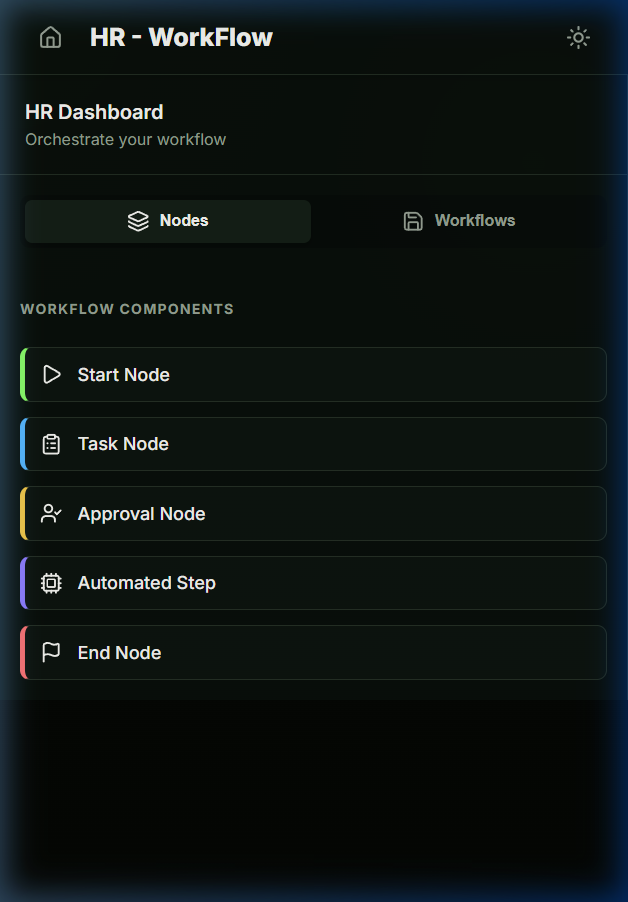
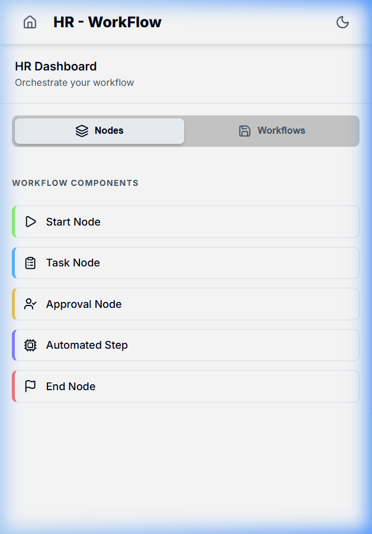
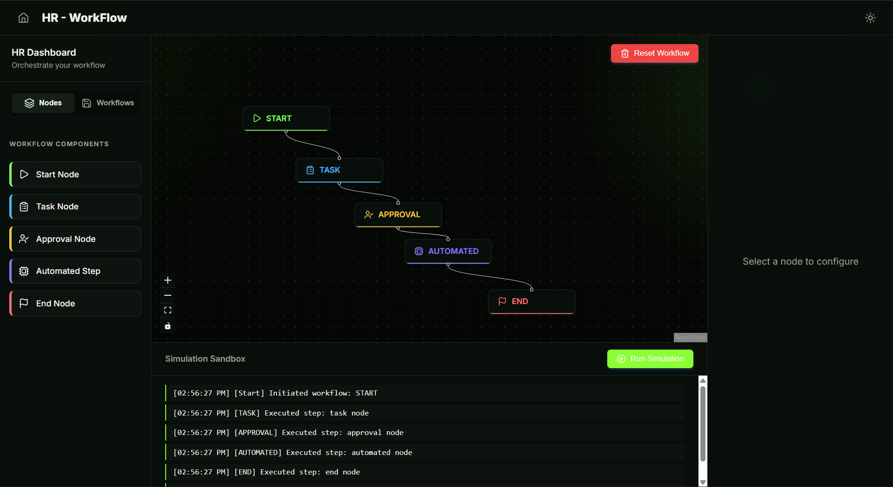
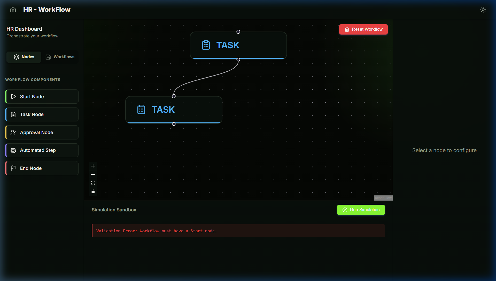

# HR — WorkFlow
### *Design. Automate. Scale.*


**HR - WorkFlow** is a premium, visual studio designed for modern HR teams to orchestrate and automate their internal processes. Whether it's onboarding a new hire, managing leave approvals, or triggering automated email sequences, this tool provides a drag-and-drop interface to build complex logic without writing a single line of code.

---

## ✨ Key Features

<table>
  <tr>
    <td align="center" width="160"><b>🖱️ Drag-and-Drop<br>Designer</b><br><sub>Build workflows with specialized nodes — Start, Task, Approval, Automated Step, and End.</sub></td>
    <td align="center" width="160"><b>💾 Workflow<br>Persistence</b><br><sub>Name, save, and reload workflow snapshots from a managed library.</sub></td>
    <td align="center" width="160"><b>▶️ Simulation<br>Engine</b><br><sub>Traverse and test your graph with live, timestamped audit logs before going live.</sub></td>
    <td align="center" width="160"><b>⚠️ Error<br>Detection</b><br><sub>Canvas highlights broken paths and infinite loops in real time.</sub></td>
    <td align="center" width="160"><b>◐ Dual<br>Theme</b><br><sub>Switch between immersive Dark Mode and crisp Light Mode from any page.</sub></td>
  </tr>
</table>

---

## 🔷 Node Types

| Node | Color | Purpose |
|------|-------|---------|
| **Start Node** | 🔵 Blue | The entry point for every process |
| **Task Node** | 🟢 Teal | Assign human tasks to specific team members |
| **Approval Node** | 🟡 Amber | Decision points for manager sign-off |
| **Automated Step** | 🟠 Coral | Trigger API actions like sending emails or generating documents |
| **End Node** | 🟢 Green | Marks successful process completion |

---

## 🛠️ Tech Stack

| Layer | Technology | Purpose |
|-------|-----------|---------|
| **Frontend** | [React](https://reactjs.org/) + [Vite](https://vitejs.dev/) | UI framework & build tool |
| **Visual Programming** | [React Flow](https://reactflow.dev/) | Node-based canvas engine |
| **State Management** | [Zustand](https://github.com/pmndrs/zustand) | Lightweight reactive state |
| **Styling** | Vanilla CSS | Custom design system with CSS variables |
| **Icons** | [Lucide React](https://lucide.dev/) | Consistent iconography |
| **Language** | [TypeScript](https://www.typescriptlang.org/) | Strictly typed for reliability |

---

## 📂 Project Architecture

```text
src/
├── components/          # 🧩 Reusable UI Components
│   ├── common/          # Global elements (ThemeToggle)
│   ├── config-panel/    # Node detail editor
│   ├── flow/            # Core React Flow canvas logic
│   ├── landing/         # Premium entry page
│   ├── nodes/           # Custom node definitions (Task, Approval, etc.)
│   ├── sandbox/         # Workflow simulation area
│   └── sidebar/         # Drag-source & Saved workflows
├── hooks/               # Custom React Hooks (useSimulation, validation)
├── services/            # API calls & Simulation logic
├── store/               # Zustand State Management
├── types/               # TypeScript Interfaces
└── index.css            # Global Design System & Variables
```

---

## 📸 In Action

### The Designer Studio
| Dark Mode | Light Mode |
|-----------|------------|
|  |  |

### Simulation & Error Detection
| Simulation Logs | Error Detection |
|-----------------|-----------------|
|  |  |

---

## 🚀 Getting Started

```bash
# 1. Clone the repo
git clone <your-repo-url>

# 2. Install dependencies
npm install

# 3. Run locally
npm run dev

# 4. Build for production
npm run build
```

---

## 🗺️ Future Roadmap

| Initiative | Description |
|------------|-------------|
| 🔵 **End-to-End Automation** | Convert mock simulation into a real engine with live service integrations (SendGrid, AWS SES) |
| 🟢 **Persistent Backend** | Dedicated API (Node.js / Go) for business logic and workflow state management |
| 🟡 **Scalable Databases** | Distribute workflow graphs, member data, and audit logs on Cloudflare or Aiven Cloud |
| 🟠 **Team Collaboration** | Multi-user real-time editing with role-based access control (RBAC) |

---

<div align="center">
  <sub>Built for <b>HR Team Efficiency</b> by <b>Vedant Sanjay Amrutkar</b></sub>
</div>