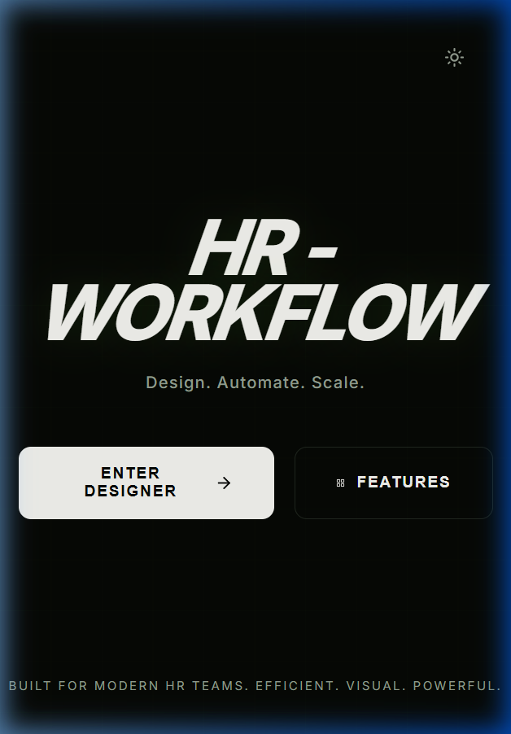
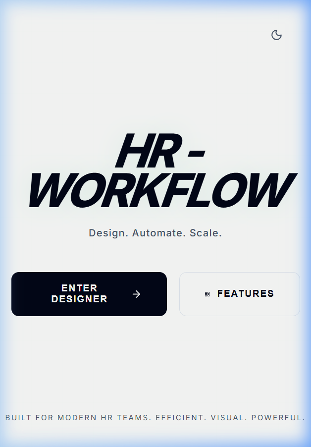
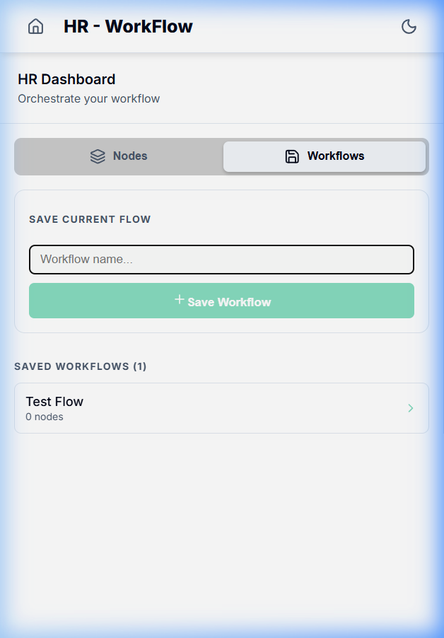

#  HR - WorkFlow

### *Design. Automate. Scale.*

**HR - WorkFlow** is a premium, visual studio designed for modern HR teams to orchestrate and automate their internal processes. Whether it's onboarding a new hire, managing leave approvals, or triggering automated email sequences, this tool provides a drag-and-drop interface to build complex logic without writing a single line of code.

---

## ✨ Key Features

### 1. 🏗️ Drag-and-Drop Designer
Build your workflows using specialized nodes:
- **Start Node**: The entry point for your process.
- **Task Node**: Assign human tasks to specific team members.
- **Approval Node**: Set up decision points for managers.
- **Automated Step**: Trigger API actions like sending emails or generating documents.
- **End Node**: Mark the successful completion of a workflow.

### 2. 💾 Workflow Persistence
Never lose your work. The **Workflows Tab** allows you to:
- Name and **Save** snapshots of your canvas designs.
- **Load** any saved workflow back onto the canvas instantly.
- Manage a library of different process versions.

### 3. 🧪 Real-time Simulation & Logs
Test your workflows before they go live:
- Run a **Simulation Engine** that traverses your graph.
- View **Live Audit Logs** with exact timestamps for every process.
- **Visual Validation**: The canvas automatically highlights errors (like broken paths or infinite loops) with red borders and alerts.

### 4. 🌓 Theme Toggle
Accessible from everywhere! Toggle the mood of your workspace from the top-right corner of any page.

---

## 🎨 Dual Theme Experience

The entire studio is built with a **Premium Dual Theme Engine**. Switch between a sleek, high-tech **Dark Mode** and a professional, clean **Light Mode** with a single click.

*Landing Page - Immersive Dark Mode*

*Landing Page - Crisp Light Mode*

---

## 🛠️ Tech Stack

Built with a modern, high-performance stack for a smooth user experience:

- **Frontend**: [React](https://reactjs.org/) + [Vite](https://vitejs.dev/)
- **Visual Programming**: [React Flow](https://reactflow.dev/) (Industry standard for node-based UIs)
- **State Management**: [Zustand](https://github.com/pmndrs/zustand) (Lightweight and reactive)
- **Styling**: [Vanilla CSS](https://developer.mozilla.org/en-US/docs/Web/CSS) (Custom-built design system with modern CSS variables)
- **Icons**: [Lucide React](https://lucide.dev/) (Beautiful and consistent iconography)
- **Language**: [TypeScript](https://www.typescriptlang.org/) (Strictly typed for reliability)

---

## 📸 In Action

### The Designer Studio

*The core design engine in Dark Mode*

*The core design engine in Light Mode*

### Managing Workflows

*Saved workflows library in the sidebar*

### Simulation Engine

*Timestamped logs providing a full execution trail*

---

## 🚀 Getting Started

1. **Clone the repo**
2. **Install dependencies**: `npm install`
3. **Run locally**: `npm run dev`
4. **Build for production**: `npm run build`

---

Built for **HR Team Efficiency** by **Vedant Sanjay Amrutkar**.
